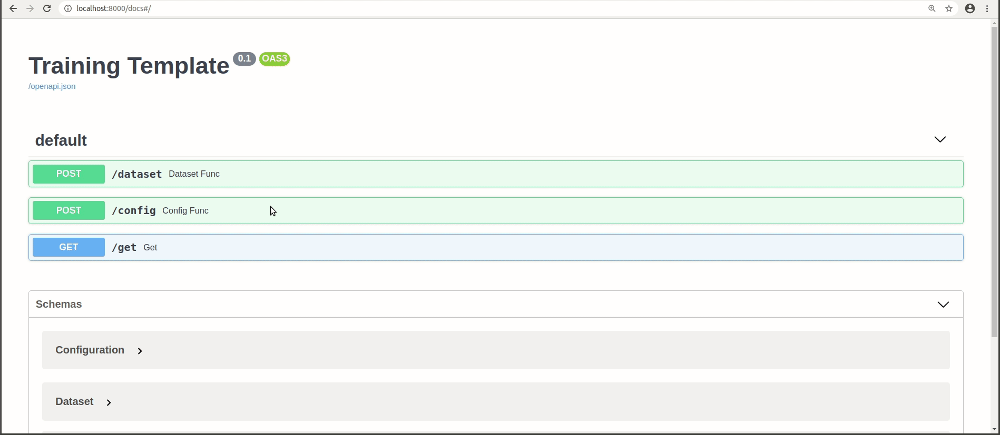
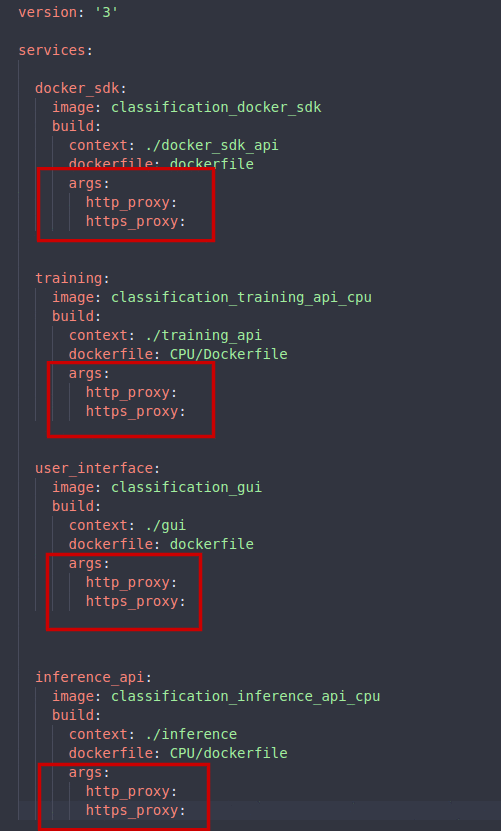

#  Gluoncv Classification API 

This repository allows you to get started with training a State-of-the-art Deep Learning model with little to no configuration needed! You provide your labeled dataset and you can start the training right away. This repo is based on [Gluoncv's](https://gluon-cv.mxnet.io/build/examples_classification/index.html) Framework. You can check the networks stats [here](https://gluon-cv.mxnet.io/model_zoo/classification.html)



## Prerequisites

- Linux or windows
- NVIDIA Drivers (410.x or higher) (optional : for gpu training )
- Docker CE latest stable release 
- NVIDIA Docker 2 (optional: for gpu training)


#### How to check for prerequisites

**To check if you have docker-ce installed:** 

​               `docker --version`

**To check if you have docker-compose installed:**

​                `docker-compose --version`

**To check if you have nvidia-docker installed:**

​                `nvidia-docker --version`

**To check your nvidia drivers version, open your terminal and type the command `nvidia-smi`**


#### Installing Prerequisites

\- If you don't have neither docker nor docker-compose use the following  command 

  ​			`chmod +x install_full.sh && source install_full.sh`

\- If you have docker ce installed and wish only to install docker-compose and perform necessary operations,  use the following command 

  ​			`chmod +x install_compose.sh && source install_compose.sh`

\- If both docker ce and docker-compose are installed then use the following command: 

  ​			`chmod +x install_minimal.sh && source install_minimal.sh`

\- Install NVIDIA Drivers (410.x or higher) and NVIDIA Docker for GPU training by following the [official docs](https://github.com/nvidia/nvidia-docker/wiki/Installation-(version-2.0))


## Changes To Make

- Go to  `gui/src/environments/environment.ts ` and `gui/src/environments/environment.prod.ts  ` and change the following:

- field `url`:  
must match the IP address of your machine
      
- the IP field of the `inferenceAPIUrl `: must match the IP address of your machine (**Use the `ifconfig `command to check your IP address . Please use your private IP which starts by either 10. or 172.16.  or 192.168.**)


  

	 _environment.ts_


  

	 _environment.prod.ts_

- If you are behind a proxy, change the `args` `http_proxy` and `https_proxy`in `build_cpu.yml` or `build_gpu.yml` (depending on your mode) to match the address of your proxy. (**you can find build.yml in the repo's root directory**)

  


## Label your own dataset

To classify your own images for training, you can install the [labelme](https://github.com/wkentaro/labelme/) labeling tool. Check the specific classification [documentation](https://github.com/wkentaro/labelme/tree/master/examples/classification) to know more about labeling using labelme.

## Dataset Folder Structure

We offer a sample dataset to use for training. It's called "dummy_dataset".

The following is an example of how a dataset should be structured. Please put all your datasets in the data folder.

```sh
├──data/
    ├──dummy_dataset/
        ├── class
        │   ├── img_1.jpg
        │   └── img_2.jpg
        ├── class2
            |__img_0.jpg
            │── img_1.jpg
            │── img_2.jpg

```


## Build the Solution

To build the solution, run the following command from the repository's root directory

```sh
docker-compose -f build_cpu.yml build #(cpu mode)
docker-compose -f build_gpu.yml build #(gpu mode)
```

## Run the Solution

To run the solution, run the following command from the repository's root directory

```sh
docker-compose -f run_cpu.yml up #(cpu mode)
docker-compose -f run_gpu.yml up #(gpu mode)
```


## Prepare Custom Dataset

After running the docker container, run this command if you labeled your dataset with the labelme labeling-tool:

```sh 
python3 preparedataset.py --datasetpath <your_resulting_folder>
```

A new folder called **customdataset** will be created, just copy it into **data** in order to train.

This is how the **customdataset** folder should look like :

```sh
├──customdataset/
        ├── class
        │   ├── img_1.jpg
        │   └── img_2.jpg
        ├── class2
            |__img_0.jpg
            │── img_1.jpg
            │── img_2.jpg

```
