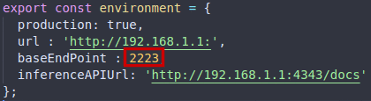
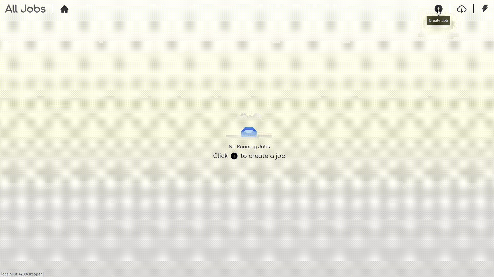
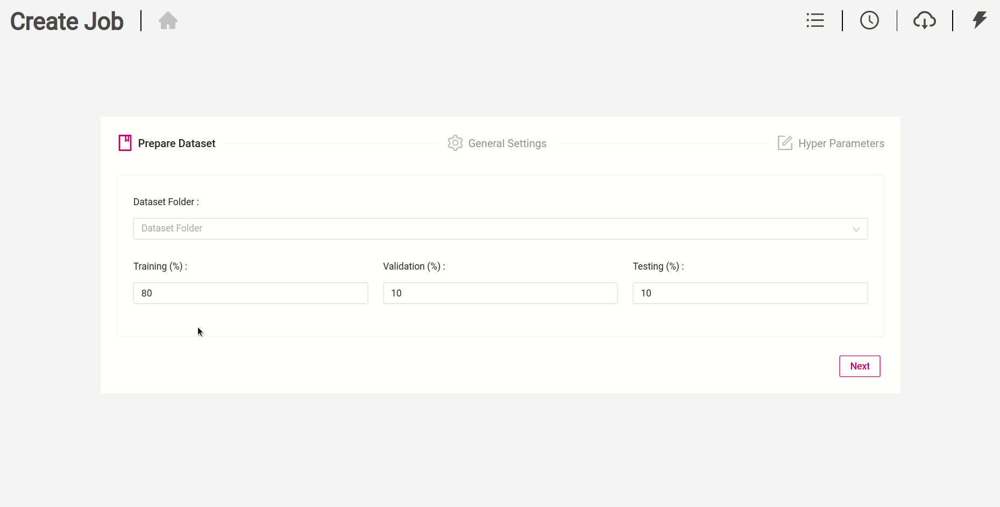
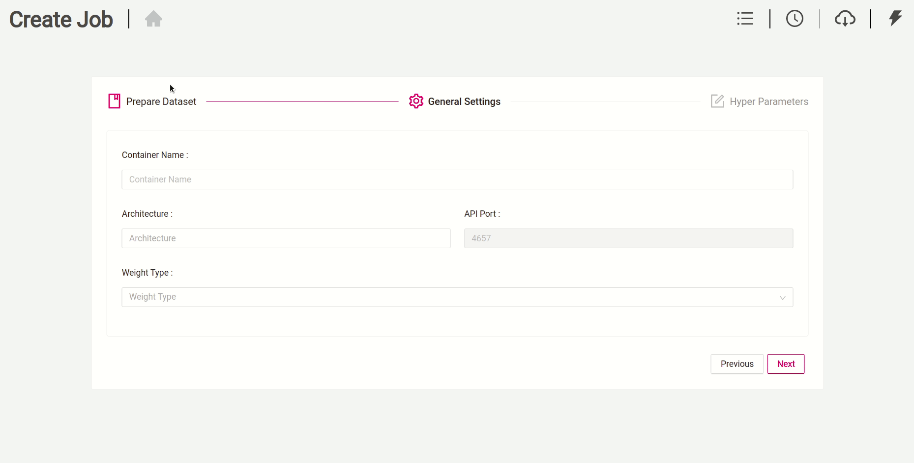
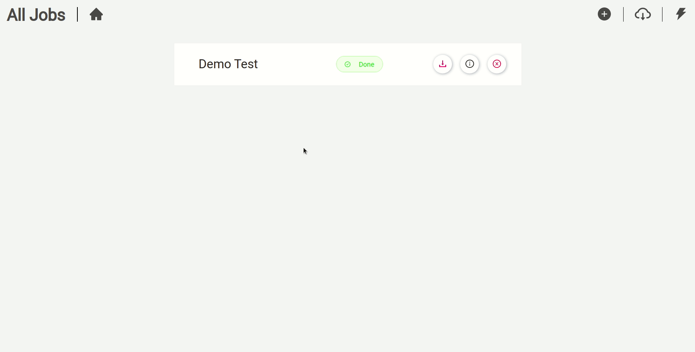
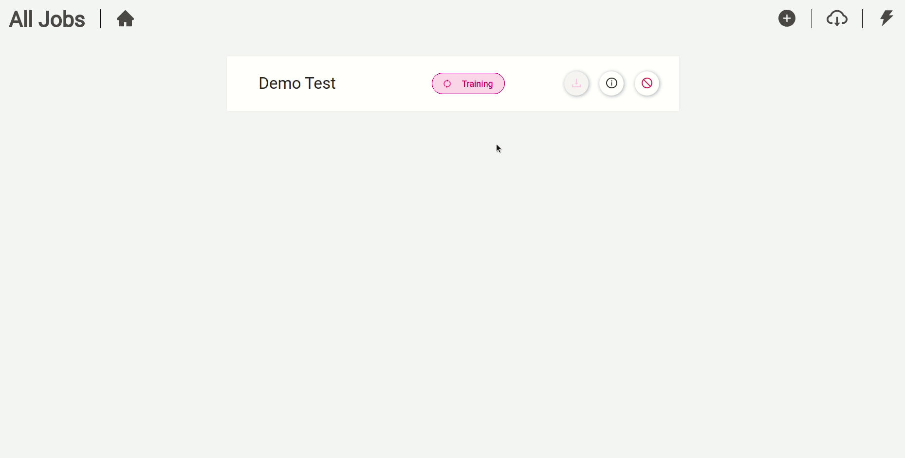
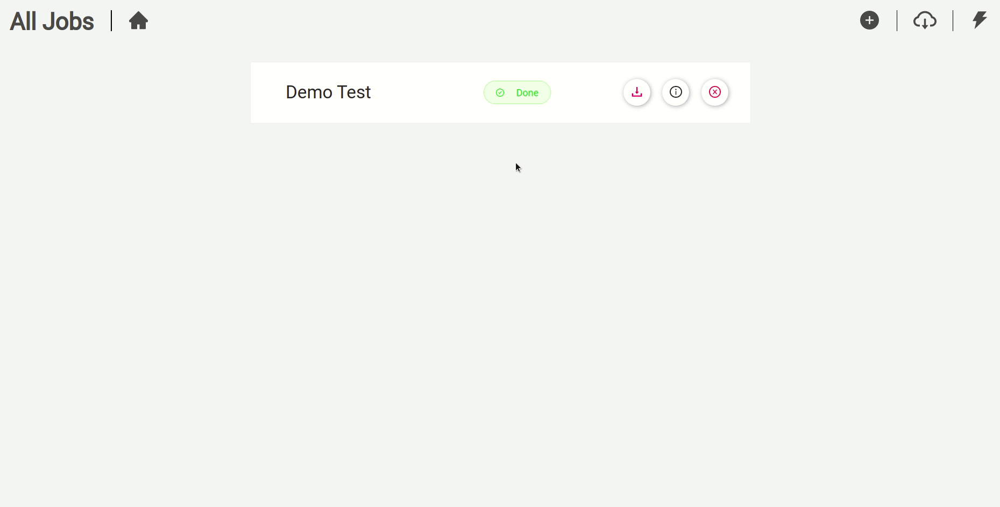

#  Image Classification Training GUI - CPU/GPU for linux

This repository allows you to get started with training a State-of-the-art Deep Learning model with little to no configuration needed! You provide your labeled dataset and you can start the training right away. You can even test your model with our built-in Inference REST API. Training classification models with GluonCV has never been so easy.


- This repo is based on the [Gluoncv](https://gluon-cv.mxnet.io/build/examples_classification/index.html) Framework. 
- The app supports all the networks in the [GluonCV model zoo](https://gluon-cv.mxnet.io/model_zoo/classification.html)
- All networks can be trained from scratch or using pretrained weights.
- The solution contains both training and inference APIs.
- The training API supports both CPU and GPU architectures.
- The built-in inference API supports CPU architectures.
- It is recommended to use google Chrome when using the training app.


<br>
<br>

---

## Prerequisites

- Linux or windows
- NVIDIA Drivers (410.x or higher) (optional : for gpu training )
- Docker CE latest stable release 
- NVIDIA Docker 2 (optional: for gpu training)

<br>

### How to check for prerequisites

**To check if you have docker-ce installed:** 

​               `docker --version`

**To check if you have docker-compose installed:**

​                `docker-compose --version`

**To check if you have nvidia-docker installed:**

​                `nvidia-docker --version`

**To check your nvidia drivers version, open your terminal and type the command `nvidia-smi`**


<br>


### Installing Prerequisites

\- If you don't have neither docker nor docker-compose use the following  command 

  ​			`chmod +x install_full.sh && source install_full.sh`

\- If you have docker ce installed and wish only to install docker-compose and perform necessary operations,  use the following command 

  ​			`chmod +x install_compose.sh && source install_compose.sh`

\- If both docker ce and docker-compose are installed then use the following command: 

  ​			`chmod +x install_minimal.sh && source install_minimal.sh`

\- Install NVIDIA Drivers (410.x or higher) and NVIDIA Docker for GPU training by following the [official docs](https://github.com/nvidia/nvidia-docker/wiki/Installation-(version-2.0))

<br>
<br>

### Validating prerequisites 

Make sure that the `base_dir` field in `docker_sdk_api/data/paths.json` is correct (it must match the path of the root of the repo on your machine).


## Changes To Make

- Go to `docker_sdk_api/api/data/paths.json` and change the following:

  - if you wish to deploy the training solution on GPUs (default mode), please set the field `image_name` to:<br>
    **classification_training_api_gpu** 
  
    ​      
    ​    

   - if you wish to deploy the training solution on CPU, please set the field `image_name` to: **classification_training_api_cpu** 


<br>
<br>


- Go to  `gui/src/environments/environment.ts ` and `gui/src/environments/environment.prod.ts  ` and change the following:

  - field `url`:  
must match the IP address of your machine
    
  - the IP field of the `inferenceAPIUrl `: must match the IP address of your machine (**Use the `ifconfig `command to check your IP address . Please use your private IP which starts by either 10. or 172.16.  or 192.168.**)


  

	 _environment.ts_


  

	 _environment.prod.ts_

<br>
If you are behind a proxy:

  - Enter you proxy settings in the `docker_sdk_api/api/data/proxy.json ` file

    


  - From the repo's root directory, issue the following command:

  ```sh
    python3 set_proxy_args.py
  ```

<br>

Docker SDK api uses the port **2223** to run.<br>
In case this port is used by another application. The api can be configured to run on a different port by doing the following steps:

* Go to _docker_sdk_api/dockerfile_ and change the value after the --port flag in the CMD command.


* Go to gui/src/environments/environment.ts and gui/src/environments/environment.prod.ts and change the `baseEndPoint` field value to match the newly selected port:


<br>
_gui/src/environments/environment.ts_

<br>

<br>
_gui/src/environments/environment.prod.ts_

<br>
<br>

---

## Label your own dataset

To classify your own images for training, you can install the [labelme](https://github.com/wkentaro/labelme/) labeling tool. Check the specific classification [documentation](https://github.com/wkentaro/labelme/tree/master/examples/classification) to know more about labeling using labelme.

<br>
<br>

---

## Dataset Folder Structure

We offer a sample dataset to use for training. It's called "dummy_dataset".

The following is an example of how a dataset should be structured. Please put all your datasets in the data folder.

```sh
├──data/
    ├──dummy_dataset/
        ├── class
        │   ├── img_1.jpg
        │   └── img_2.jpg
        ├── class2
            |__img_0.jpg
            │── img_1.jpg
            │── img_2.jpg

```

<br>
<br>

---

## Lightweight, Midweight and Heavyweight Solution

**Lightweight (default mode):**  Building the docker image without pre-downloading any online pre-trained weights, the online weights will be downloaded when needed after running the image.
<br>

**Midweight:** Downloading specific online pre-trained weights during the docker image build.<br>
 To do that, open the json file `training_api/midweight_heavyweight_solution/networks.json` and change the values of the networks you wish to download to "true". 
<br>

**Heavyweight :** Downloading all the online pre-trained weights during the docker image build. <br>
 To do that, open the json file `training_api/midweight_heavyweight_solution/networks.json` and change the value of "select_all" to "true".

<br>
<br>

---

## Build the Solution

If you wish want to deploy the training workflow in GPU mode, please write the following command

```sh
docker-compose -f build_gpu.yml build
```

<br>

If you wish want to deploy the training workflow in CPU mode, please write the following command

```sh
docker-compose -f build_cpu.yml build 
```
<br>


<br>


---
## Run the Solution
If you wish want to deploy the training workflow in GPU mode, please write the following command

```sh
docker-compose -f run_gpu.yml up
```

<br>

If you wish to deploy the training workflow in CPU mode, please write the following command

```sh
docker-compose -f run_cpu.yml up
```


---

## Prepare Custom Dataset

After running the docker container, run this command if you labeled your dataset with the [labelme](https://github.com/wkentaro/labelme/) labeling-tool:

```sh 
python3 preparedataset.py --datasetpath <your_resulting_folder>
```

A new folder called **customdataset** will be created, just copy it into **data** in order to train.

This is how the **customdataset** folder should look like :

```sh
├──customdataset/
        ├── class
        │   ├── img_1.jpg
        │   └── img_2.jpg
        ├── class2
            |__img_0.jpg
            │── img_1.jpg
            │── img_2.jpg

```
<br>
<br>

---

## Usage

- If the app is deployed on your machine:  open your web browser and type the following: `localhost:4200` or `127.0.0.1:4200  `


- If the app is deployed on a different machine: open your web browser and type the following: `<machine_ip>:4200`


<br>


#### 1- Preparing Dataset

Prepare your dataset for training




<br>


#### 2- Specifying General Settings

Specify the general parameters for you docker container




<br>

#### 3- Specifying Hyperparameters

Specify the hyperparameters for the training job




<br>

#### 4- Checking training logs

Check your training logs to get better insights on the progress of the training



<br>

#### 5- Downloading Models

Download your model to use it in your applications



<br>

#### 6- Stopping and Delete the model's container

Delete the container's job to stop an ongoing job or to remove the container of a finished job. (Finished jobs are always available to download)



<br>
<br>

---

## Possible Errors

The training might fail when a network isn't available anymore on the Gluoncv model_zoo server (pretrained online weights). If you encounter this error (image below), kindly create an issue.


## Acknowledgments

- Roy Anwar, BMW Innovation Lab, Munich, Germany

- Joe Sleiman, [inmind.ai](https://inmind.ai/), Beirut, Lebanon

- Ismail Shehab, [inmind.ai](https://inmind.ai/), Beirut, Lebanon

- Fouad Chaccour, Beirut, Lebanon

- Hadi Koubeissy, Beirut, Lebanon

- Jimmy Tekli, BMW Innovation Lab, Munich, Germany
