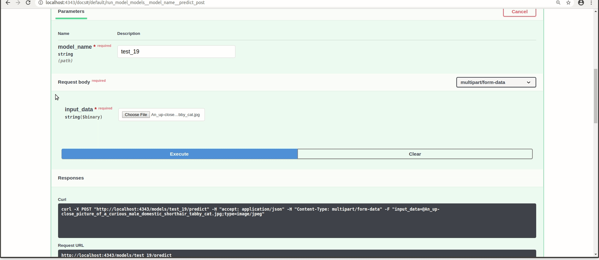

# Gluoncv classification GPU/CPU Inference API 

This is a repository for an image classification inference API using the [Gluoncv](https://gluon-cv.mxnet.io/build/examples_classification/index.html) framework.

The inference REST API works on CPU. It's supported on Windows and Linux Operating systems.

Models trained using our Gluoncv Classification training  repository can be deployed in this API. Several models can be loaded and used at the same time.




## Prerequisites

- OS:
  - Windows or Linux
- Docker

### Check for prerequisites

To check if you have docker-ce installed:

```sh
docker --version
```

### Install prerequisites

#### -Ubuntu

Use the following command to install docker on Ubuntu:

```sh
chmod +x install_prerequisites.sh && source install_prerequisites.sh
```

#### -Windows 10

To [install Docker on Windows](https://docs.docker.com/docker-for-windows/install/), please follow the link.

**P.S: For Windows users, open the Docker Desktop menu by clicking the Docker Icon in the Notifications area. Select Settings, and then Advanced tab to adjust the resources available to Docker Engine.**

## Build The Docker Image

In order to build the project run the following command from the project's root directory:    

```sh
docker build -t  gluoncv_classification -f {CPU or GPU}/dockerfile .
```

### Behind a proxy

```sh
docker build --build-arg http_proxy='' --build-arg https_proxy='' -t gluoncv_classification -f ./{CPU or GPU}/dockerfile .
```

## Run the docker container

To run the API, go the to the API's directory and run the following:

#### -Using Linux based docker:

- CPU:

```sh
sudo docker run -itv $(pwd)/models:/models -p 4343:4343 gluoncv_classification
```
- GPU:

```sh
sudo nvidia-docker run -itv $(pwd)/models:/models -p 4343:4343 gluoncv_classification
```


#### -Using Windows based docker:

- CPU:

```sh
docker run -itv ${PWD}/models:/models -p 4343:4343 gluoncv_classification
```
- GPU:

```sh
docker nvidia-docker run -itv ${PWD}/models:/models -p 4343:4343 gluoncv_classification
```
The API file will be run automatically, and the service will listen to http requests on the chosen port.

## API Endpoints

To see all available endpoints, open your favorite browser and navigate to:

```
http://localhost:4343/docs
```
The 'predict_batch' endpoint is not shown on swagger. The list of files input is not yet supported.

**P.S: If you are using custom endpoints like /load, /detect, and /get_labels, you should always use the /load endpoint first and then use /detect or /get_labels**

### Endpoints summary

#### /load (GET)

Loads all available models and returns every model with it's hashed value. Loaded models are stored and aren't loaded again

#### /detect (POST)

Performs inference on specified model, image, and returns class

#### /get_labels (POST)

Returns all of the specified model labels with their hashed values

#### /models (GET)

Lists all available models

#### /models/{model_name}/load (GET)

Loads the specified model. Loaded models are stored and aren't loaded again

#### /models/{model_name}/predict (POST)

Performs inference on specified model, image, and returns class

#### /models/{model_name}/labels (GET)

Returns all of the specified model labels

#### /models/{model_name}/config (GET)

Returns the specified model's configuration

## Usage

Once you have finished training, you need to add the model to the models directory, and then use the following endpoints:

### Load

This process loads the model

### Get labels

This process shows the model's labels

### Detect

This process returns class of the specified model

### Predict 

This process returns the class of the specified model

## Model structure

The folder "models" contains subfolders of all the models to be loaded.
Inside each subfolder there should be a:

- classes.txt file: contains the name of the classes separated by a ','

- .params file : contain the models parameters

- -0000.params file : contains the models parameters

- -symbol.json file : contains the models architecture

- Config.json (This is a json file containing information about the model)

  ```json
  { 
  "configuration": 
     {
         "gpu": false,
         "cpu": true, 
         "max_number_of_predictions": 3, 
         "minimum_confidence": 0.8
     },
   "inference_engine_name":"classification" 
  }
  
  ```
    P.S:
  
    - You can change confidence and predictions values while running the API
    - The API will return a response with a confidence higher than the "minimum_confidence" value. A high "minimum_confidence" can show you only accurate predictions
    - The "max_number_of_predictions" value specifies the maximum number of classes returned and analyzed  in the API response
    - Make sure to change cpu and gpu to perform prediction on the device you need 
  


## Acknowledgements


Roy Anwar,Beirut, Lebanon

